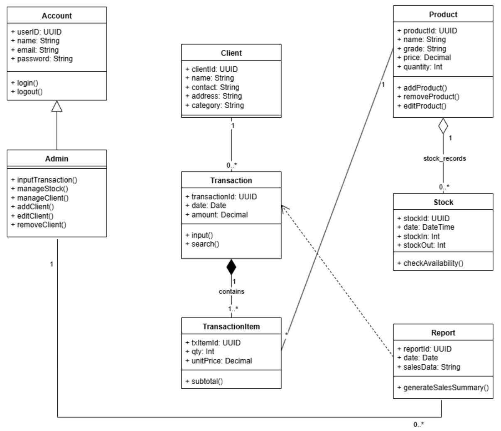
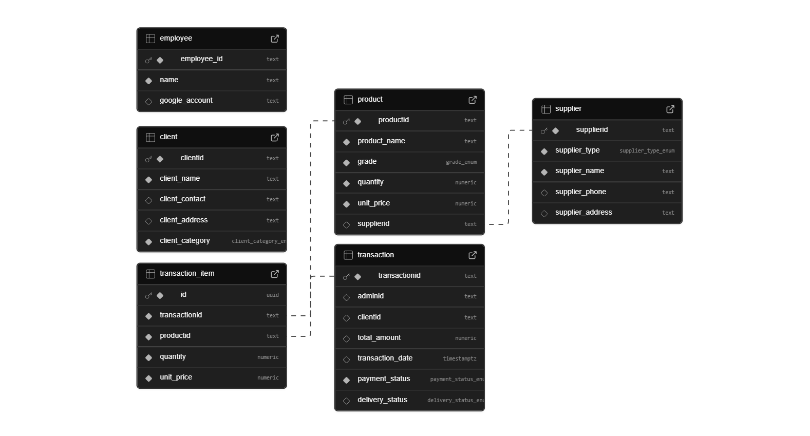

# 🎣 FishCycle

**"Ensuring every catch finds its purpose 🐟."**

FishCycle adalah sistem pencatatan dan distribusi hasil laut internal yang membantu organisasi menyalurkan **fresh catch** dan **reprocessed seafood** secara cepat, akurat, dan terdokumentasi. Aplikasi FishCycle berbasis **Windows Presentation Foundation (WPF)** yang berfungsi sebagai solusi **manajemen supply chain** hasil laut skala kecil hingga menengah. Aplikasi ini mengelola seluruh ruang lingkup operasional, mulai dari integrasi **pemasok**, **manajemen stok**, **pencatatan transaksi**, hingga pengelolaan **jaringan klien**.

## ❗ Permasalahan yang Dipecahkan

Sistem ini berfokus mengatasi masalah-masalah krusial dalam rantai pasok perikanan:

* Distribusi **seafood** yang sering **tidak efisien** dan **terlambat** karena proses manual.
* Produk **second-grade** yang tidak tersalurkan dan berujung menjadi **limbah** (pemborosan).
* Tidak adanya pencatatan **stok**, **transaksi**, dan **kualitas** produk yang terpusat dan *real-time*.
* Minimnya integrasi data antara **pemasok**, **distributor**, dan **klien**.

## 🌟 Fitur Utama

FishCycle dilengkapi dengan modul-modul penting untuk mendukung operasional harian:

1.  **Dashboard Operasional**
    * Menyajikan ringkasan **pendapatan**, **transaksi**, dan **stok utama**.
    * Integrasi data cuaca pelabuhan (*Weather API*) untuk mendukung keputusan operasional.
2.  **Manajemen Stok Terintegrasi**
    * Fungsionalitas **CRUD** (Create, Read, Update, Delete) untuk mengelola **stok** secara mendalam.
    * Pencatatan detail **kualitas produk**, **kuantitas**, dan **nilai barang**.
3.  **Transaksi Masuk dan Keluar**
    * Pencatatan rinci distribusi hasil laut, mulai dari **pemasok** hingga ke **klien**.
    * Memastikan setiap pergerakan produk terdokumentasi.
4.  **Supplier & Client Network**
    * Pengelolaan jaringan **pemasok** (nelayan, *reprocessed supplier*) dan **klien** (*retail*, industri, distributor).
5.  **Employee Management**
    * Pencatatan data pegawai internal untuk kebutuhan administratif dan akses sistem.
6.  **Google OAuth2 (@ugm.ac.id)**
    * Akses sistem yang **aman** dengan pembatasan domain (`@ugm.ac.id`).
7.  **Weather API Integration**
    * Menyediakan informasi **cuaca pelabuhan** *real-time* untuk perencanaan operasional penangkapan dan distribusi.

## 🛠️ Teknologi yang Digunakan

Aplikasi ini dikembangkan menggunakan *stack* teknologi yang modern dan *reliable*:

* **Front-end & Logic:** C# .NET
* **User Interface:** WPF (Windows Presentation Foundation)
* **Database:** PostgreSQL (dihosting melalui **Supabase**)
* **Autentikasi:** Google OAuth2 API
* **Data Eksternal:** Weather API
* **Version Control:** Git

## 🚀 Cara Menjalankan Program

Ikuti langkah-langkah berikut untuk menjalankan aplikasi FishCycle secara lokal:

1.  **Install Project:** Unduh project pada [FishCycle App](https://bit.ly/FishCycleApp) .
2.  **Jalankan Aplikasi:** Mulai aplikasi dengan membuka file FishCycleApp.exe.
3.  **Login:** Lakukan *login* menggunakan akun Google dengan domain yang terotorisasi, yaitu **`@ugm.ac.id`**.

## 👥 Developer

| Nama | Peran | Branch |
| :--- | :--- | :--- |
| **Amira Syafika Pohan** | Full-stack Developer, Database Designer | 514788 |
| **Sharon Nakisha Hezharu Putri** | Full-stack Developer, Database Engineer | 512030, 512030-test |
| **Maritza Vania Adelia** | UI/UX Designer, Front-end Developer, Quality Assurance | 517643, 517643-lab |

catatan: semua progress pengerjaan juga terdokumentasi di masing-masing branch, tidak semua dilakukan request-pull ke branch main

## 📚 Referensi Aplikasi

* OurFish
* ByCatch Management Tools
* Studi *waste reduction* dalam rantai pasok perikanan

## 📐 Class Diagram

catatan: terdapat sedikit perubahan pada hasil final aplikasi

## 🗂️ ERD (Entity Relationship Diagram)
